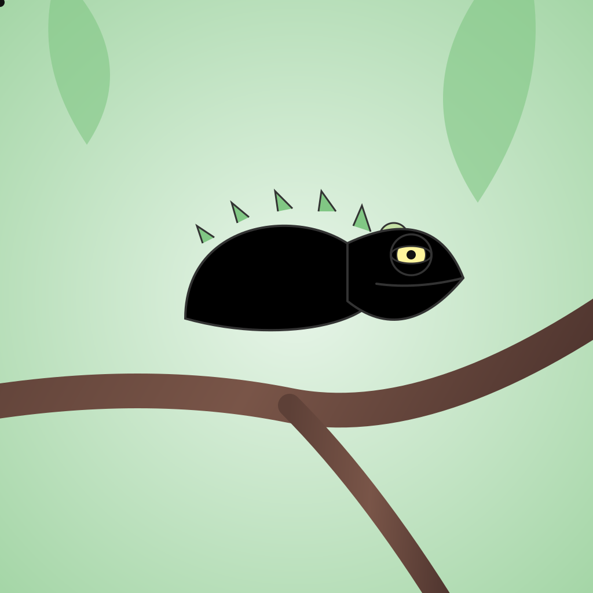

# animated-svgs

Tiny Node.js toolkit for generating animated SVGs with Gemini, then cleaning and QA-checking them.

## Stack

- Node.js 18+
- Gemini API (`gemini-3.1-pro-preview` by default)
- Local CLI + local web UI
- Lightweight structural/safety QA for SVG outputs

## Sample SVGs

### Chameleon sample



### Cardboard box sample


## Quickstart

### 1) Install

```bash
git clone <your-repo-url>
cd animated-svgs
npm install
```

### 2) Add your Gemini API key

```bash
cp .env.example .env
```

Then set one of:

- `GEMINI_API_KEY` (preferred)
- `GOOGLE_API_KEY` (also supported)

### 3) Verify key detection

```bash
npm run check:key
```

### 4) Run a local no-API smoke check

```bash
npm run pipeline -- --input-svg examples/cardboard-box.svg --name local-smoke
```

### 5) Run generation

```bash
npm run pipeline -- --prompt "A glowing jellyfish drifting in deep ocean currents."
```

## Optional commands

```bash
npm run web
npm run iterate -- --config configs/iteration.local.json
npm run qa -- --input examples/cardboard-box.svg --out-dir qa-output --report qa-output/report.json
```

## Agent-friendly setup

If you use a coding agent, it can usually complete install/setup by reading this README and running the commands above. The only hard requirement is having a Gemini API key in your environment.
