# animated-svgs

Local Node.js toolkit for generating animated SVGs with Gemini, then preprocessing and QA-checking outputs. The web workbench can also export SVG animations to Discord-compatible files (animated WebP, GIF, APNG).

## Recent updates

Since the last README edit (`53bbc98`, 2026-02-19), the web workbench added customizable prompt polish templates:

- New advanced textarea in `/generate` for polish prompt templates
- Supports placeholders `{{examples}}` and `{{userPrompt}}`
- New `Reset Template` action to restore the default template
- New API route `GET /api/polish-template` for default template + placeholders
- Added test coverage in `test/gemini-polish-template.test.js` (included in `npm run test:e2e`)

Since this edit (`2026-02-20`), the workbench also added Discord export presets:

- New preview actions: `Discord Export` preset selector + `Export for Discord`
- New API routes:
  - `GET /api/discord-export/presets`
  - `POST /api/discord-export`
- Presets for animated attachment WebP, emoji GIF/WebP, and sticker APNG

Since this edit (`2026-02-20`), the workbench also added direct SVG paste import:

- New visible `Paste SVG` entry in `/generate`
- New generation mode `Paste SVG` with `Create From Pasted SVG`
- New API route `POST /api/create-from-svg` to preprocess/sanitize and save pasted markup

## Requirements

- Node.js 18+
- `npm install`
- Gemini API key for generation/polish features (`GEMINI_API_KEY` preferred, `GOOGLE_API_KEY` supported)
- Optional for Discord export: `ffmpeg` on `PATH` plus local Chrome/Chromium
- Optional browser override: `DISCORD_EXPORT_CHROME=/path/to/browser`

Setup:

```bash
cp .env.example .env
```

## Quickstart

```bash
npm install
npm run check:key
npm run pipeline -- --input-svg examples/pulse.svg --name local-smoke
npm run pipeline -- --prompt "A glowing jellyfish drifting in deep ocean currents."
```

## Commands

```bash
npm run check:key
npm run pipeline -- --prompt "..."
npm run pipeline -- --prompt-file prompts/sword-swing.txt --name sword-swing
npm run pipeline -- --input-svg examples/cardboard-box.svg --name local-test
npm run qa -- --input examples/pulse.svg --out-dir qa-output --report qa-output/report.json
npm run iterate -- --config configs/iteration.local.json
npm run dashboard -- --dir runs-lab
npm run view -- --dir runs-lab --port 4173
npm run web
npm run test:e2e
npm run probe:gemini
```

## Web app

Start:

```bash
npm run web
```

Routes:

- `http://127.0.0.1:3000/` for the saved SVG grid (main view)
- `http://127.0.0.1:3000/generate` (or `/workbench`) for generation controls

Discord export:

- In `/generate`, open the preview panel and use `Discord Export` + `Export for Discord` to download a Discord-ready animated file.

Generation modes in the workbench:

- `Examples`: rotate/select fixed prompts, run `Generate Selected`, or run `Generate Parallel`
- `Custom`: write your own prompt, `Polish Prompt`, then `Generate Custom`
- `Paste SVG`: paste raw `<svg>...</svg>` markup and save directly with `Create From Pasted SVG`

Advanced generation settings:

- Model override
- Max output tokens
- Reasoning level (`off`, `low`, `medium`, `high`)
- Polish Prompt Template (with optional `{{examples}}` and `{{userPrompt}}` placeholders)

Preview export actions:

- Copy raw SVG source
- Export to Discord-compatible animated file presets
  - `attachment-webp` (chat upload target)
  - `emoji-webp`, `emoji-gif` (server emoji target)
  - `sticker-apng` (server sticker target)

Output locations:

- Saved prompts: `prompts/saved-prompts.jsonl`
- Created SVGs: `results/web-created/`
- Hidden/archived SVGs: `results/web-archived/`
- On first run, sample SVGs from `examples/` are seeded into the created library

## Pipeline flow

1. Read prompt text or local SVG (`--input-svg`)
2. Generate with Gemini (API mode) via `src/lib/gemini.js`
3. Preprocess SVG via `src/lib/preprocess.js`
4. Run QA via `src/lib/qa.js`
5. Write run artifacts and summary under `runs*/`

## Sample SVGs



